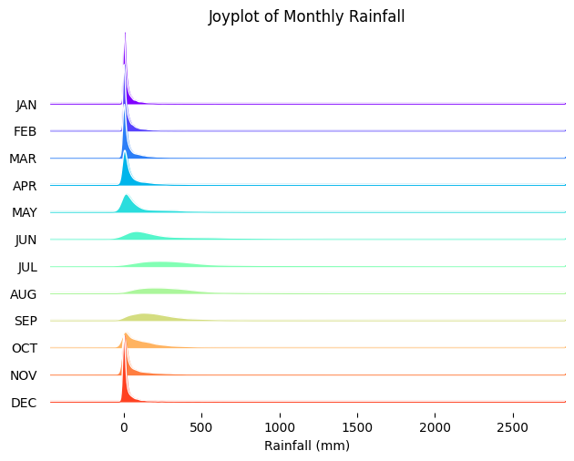
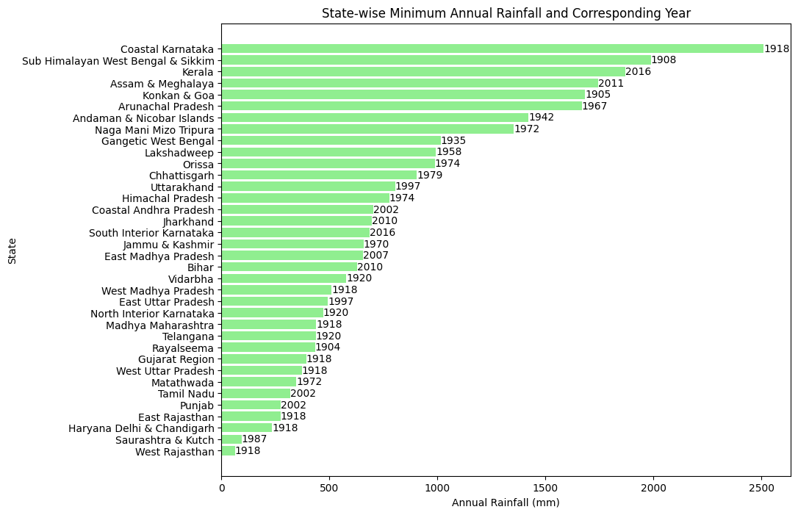
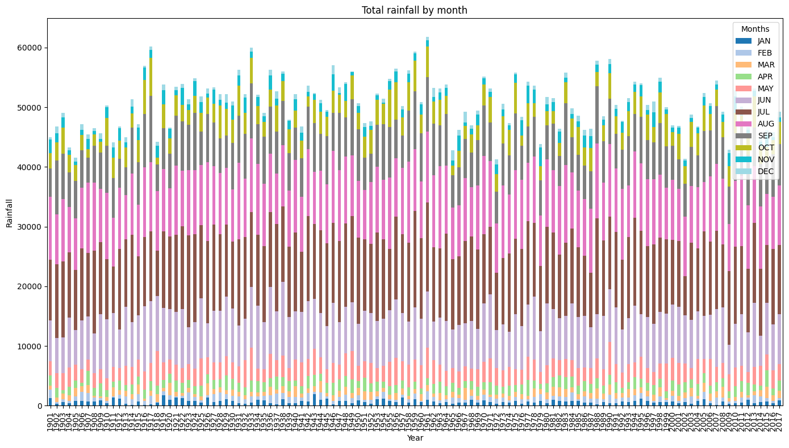
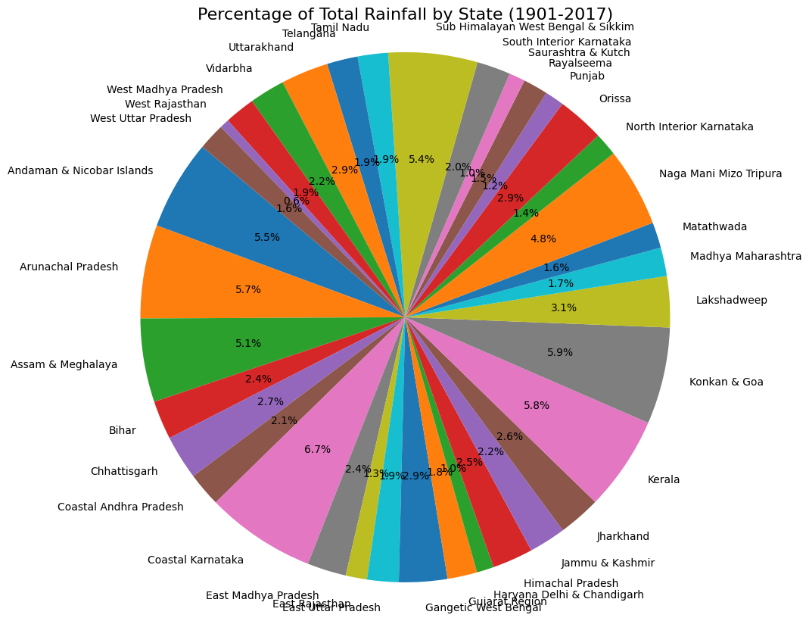
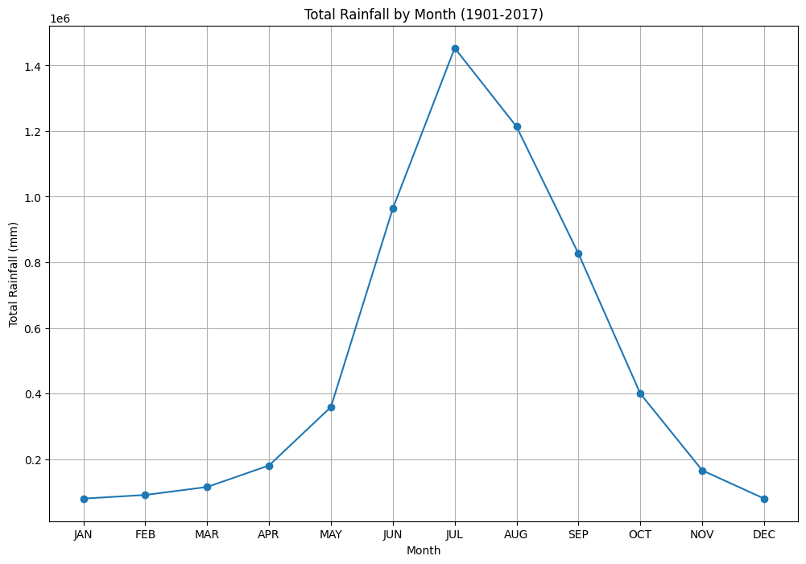
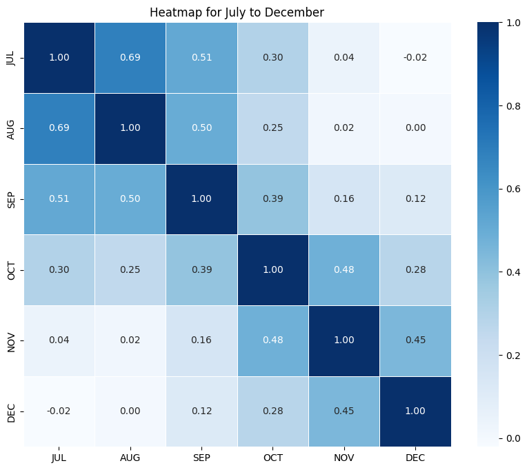
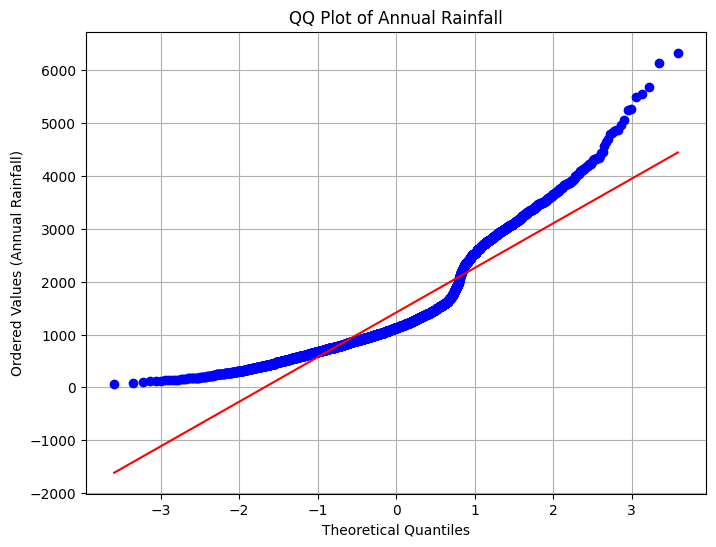
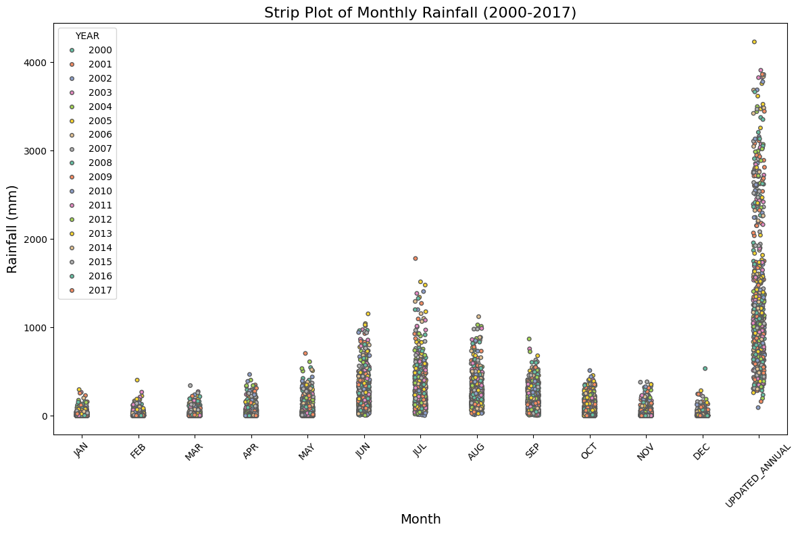
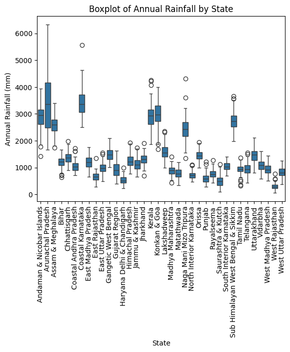
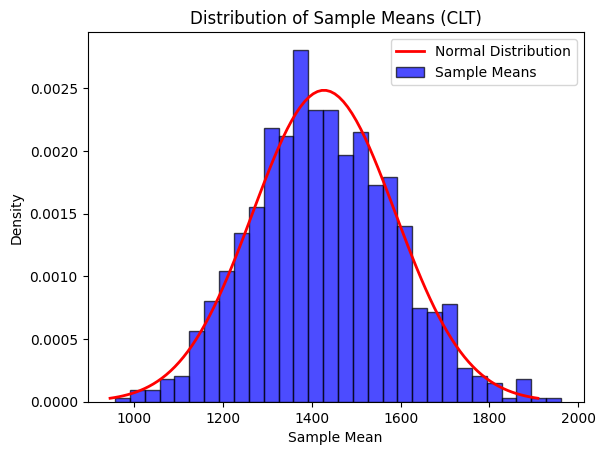

# Rainfall-Data-Analysis-Visualization

## DAV PROJECT

### Objective ⭐

This project focuses on the analysis and visualization of state-wise maximum annual rainfall in India. It involves preprocessing, analyzing, and visualizing the dataset to extract meaningful insights. The main objectives of this project are:

- Analysis of state-wise maximum annual rainfall.
- Visualization of state-wise maximum annual rainfall.
- Visualization of annual rainfall for all states in 2010.
- Visualizing annual rainfall across states for a specific year.
- Random and systematic sampling of annual rainfall data.
- Creating various plots and charts to visualize the data.

### Dataset Information ⭐

The dataset used in this project includes annual rainfall data from 1901 to 2019 for different states in India.

### Installation ⭐

To run this project, you need to have Python and the following libraries installed:

- pandas
- numpy
- seaborn
- matplotlib
- joypy
- statsmodels
- scipy
- sklearn

### Usage ⭐

To use this project, follow these steps:

1. Clone the repository to your local machine.
2. Open the `DAV_project.ipynb` file in Jupyter Notebook or JupyterLab.
3. Run the cells in the notebook to see the data analysis and visualizations.

### Project Structure ⭐

The project is organized as follows:

#### Data Loading and Preprocessing

- Load the dataset and perform necessary preprocessing steps.

#### Exploratory Data Analysis (EDA)

- Analyze the dataset to understand the distribution and frequency of rainfall.

#### Data Visualization

- Analysis of State-wise Maximum Annual Rainfall
- Visualization of State-wise Maximum Annual Rainfall
- Visualization of Annual Rainfall for All States in 2010
- Visualizing Annual Rainfall Across States for a Specific Year
- Random and Systematic Sampling of Annual Rainfall Data
- Stacked Bar Chart of Total Rainfall by Month Over the Years
- Pie Chart of Percentage Total Rainfall by State (1901-2017)
- Line Plot of Total Rainfall by Month (1901-2017)
- Bar Plot of Total Rainfall by Year (1901-2019)
- Correlation Heatmap for July to December
- QQ Plot of Annual Rainfall
- Joyplot of Monthly Rainfall
- Mosaic Plot: Rainfall Distribution by Month and State
- Treemap of Annual Rainfall by Year
- Strip Plot of Monthly Rainfall for the Year 2010
- Strip Plot of Monthly Rainfall (2000-2017)
- Strip Plot of Monthly Rainfall for [State] ([Month])
- Rainfall Across Months for the Year [Random Year]
- Rainfall Distribution in [Random State] Across All Years
- Boxplot of Annual Rainfall by State

### Screenshots ⭐

#### Screenshot 1

_Description: This screenshot shows a line plot of the total rainfall by month from 1901 to 2017. The plot highlights the trends and patterns in monthly rainfall over the years._

#### Screenshot 2

_Description: This screenshot shows a joyplot of monthly rainfall data, illustrating the distribution and density of rainfall for each month across the years._

#### Screenshot 3

_Description: This screenshot shows the state-wise minimum annual rainfall and the corresponding year, providing insights into the lowest recorded rainfall for each state._

#### Screenshot 4

_Description: This screenshot shows the distribution of annual rainfall across states for a specific year, highlighting the variability in rainfall amounts among different states._

#### Screenshot 5

_Description: This screenshot shows a stacked bar chart of total rainfall by month over the years, giving a visual representation of monthly rainfall trends over time._

#### Screenshot 6

_Description: This screenshot displays a pie chart showing the percentage of total rainfall by state, providing a visual distribution of rainfall across different states._

#### Screenshot 7

_Description: This screenshot shows a line plot of total rainfall by month, illustrating the monthly trends in rainfall over the selected period._

#### Screenshot 8

_Description: This screenshot shows a correlation heatmap for rainfall data from July to December, highlighting the relationships between different months._

#### Screenshot 9

_Description: This screenshot features a QQ plot of annual rainfall data to assess the normality of the rainfall distribution._

#### Screenshot 10

_Description: This screenshot shows a joyplot of monthly rainfall, illustrating the distribution and density of rainfall for each month across the years._

#### Screenshot 11

_Description: This screenshot displays a strip plot of monthly rainfall, providing a visual representation of rainfall amounts for each month over the years._

#### Screenshot 12

_Description: This screenshot shows a boxplot of annual rainfall by state, highlighting the distribution and variability of rainfall across different states._

#### Screenshot 13

_Description: This screenshot shows the distribution of sample means, demonstrating the Central Limit Theorem (CLT) which states that the sampling distribution of the sample means approaches a normal distribution as the sample size increases._

#### Screenshot 14

_Description: This screenshot shows the bootstrap sampling distribution, illustrating the variability and confidence intervals of the sample means obtained through resampling._

### Conclusion ⭐

This project provides a comprehensive analysis and visualization of annual rainfall data across different states in India, offering valuable insights into rainfall patterns and trends over the years.

### License ⭐

This project is licensed under the MIT License.

### Contact ⭐

For any questions or collaboration, feel free to reach out to:

- Name: Raghav Agiwal
- Email: raghavagiwal20@gmail.com
- GitHub: [Your GitHub Profile](https://github.com/raghav0807)

<!-- C:\Users\canar\OneDrive\Desktop\Rainfall-Data-Analysis-Visualization\Screenshots\annual_rainfall.png -->
