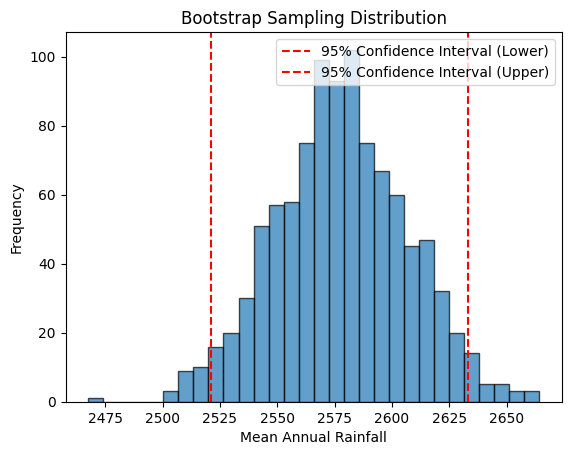

# Rainfall-Data-Analysis-Visualization

## DAV PROJECT

### Objective ⭐

This project focuses on the analysis and visualization of state-wise maximum annual rainfall in India. It involves preprocessing, analyzing, and visualizing the dataset to extract meaningful insights. The main objectives of this project are:

- Analysis of state-wise maximum annual rainfall.
- Visualization of state-wise maximum annual rainfall.
- Visualization of annual rainfall for all states in 2010.
- Visualizing annual rainfall across states for a specific year.
- Random and systematic sampling of annual rainfall data.
- Creating various plots and charts to visualize the data.

### Dataset Information ⭐

The dataset used in this project includes annual rainfall data from 1901 to 2019 for different states in India.

### Installation ⭐

To run this project, you need to have Python and the following libraries installed:

- pandas
- numpy
- seaborn
- matplotlib
- joypy
- statsmodels
- scipy
- sklearn

### Usage ⭐

To use this project, follow these steps:

1. Clone the repository to your local machine.
2. Open the `DAV_project.ipynb` file in Jupyter Notebook or JupyterLab.
3. Run the cells in the notebook to see the data analysis and visualizations.

### Project Structure ⭐

The project is organized as follows:

#### Data Loading and Preprocessing

- Load the dataset and perform necessary preprocessing steps.

#### Exploratory Data Analysis (EDA)

- Analyze the dataset to understand the distribution and frequency of rainfall.

#### Data Visualization

- Analysis of State-wise Maximum Annual Rainfall
- Visualization of State-wise Maximum Annual Rainfall
- Visualization of Annual Rainfall for All States in 2010
- Visualizing Annual Rainfall Across States for a Specific Year
- Random and Systematic Sampling of Annual Rainfall Data
- Stacked Bar Chart of Total Rainfall by Month Over the Years
- Pie Chart of Percentage Total Rainfall by State (1901-2017)
- Line Plot of Total Rainfall by Month (1901-2017)
- Bar Plot of Total Rainfall by Year (1901-2019)
- Correlation Heatmap for July to December
- QQ Plot of Annual Rainfall
- Joyplot of Monthly Rainfall
- Mosaic Plot: Rainfall Distribution by Month and State
- Treemap of Annual Rainfall by Year
- Strip Plot of Monthly Rainfall for the Year 2010
- Strip Plot of Monthly Rainfall (2000-2017)
- Strip Plot of Monthly Rainfall for [State] ([Month])
- Rainfall Across Months for the Year [Random Year]
- Rainfall Distribution in [Random State] Across All Years
- Boxplot of Annual Rainfall by State

### Screenshots ⭐

#### Screenshot 1

**Distribution of Annual Rainfall Across States**  
  
_This plot displays the distribution of annual rainfall across different states for a specific year, highlighting the variability in rainfall amounts among different states. The plot helps in understanding how annual rainfall is distributed across various states for a given year, showcasing regional variations in rainfall._

#### Screenshot 2

**Joyplot of Monthly Data**  
  
_A Joyplot (also known as a ridge plot) is a series of overlapping density plots or histograms, typically used to visualize the distribution of a numeric variable over different categories or groups. In this project, the joyplot visualizes the distribution of monthly rainfall across different years. It helps to identify patterns, variations, and trends in the monthly rainfall data._

#### Screenshot 3

**State-wise Minimum Annual Rainfall**  
  
_This plot shows the minimum annual rainfall recorded for each state and the corresponding year. It helps in identifying the year and state with the lowest recorded rainfall. This visualization highlights the state-wise minimum annual rainfall, providing insights into the lowest recorded rainfall for each state over the years._

#### Screenshot 4

**Stacked Bar Chart of Total Rainfall by Month Over the Years**  
  
_A stacked bar chart is a bar chart where each bar is divided into multiple sub-bars stacked on top of each other, representing different groups or categories. This plot visualizes the total rainfall by month over the years, with each month’s rainfall stacked to show the contribution of each month to the total annual rainfall. This screenshot shows a stacked bar chart of total rainfall by month over the years, giving a visual representation of monthly rainfall trends over time._

#### Screenshot 5

**Pie Chart of Percentage Total Rainfall by State**  
  
_A pie chart is a circular statistical graphic divided into slices to illustrate numerical proportions. The pie chart shows the percentage of total rainfall contributed by each state, providing a visual distribution of rainfall across different states. This screenshot displays a pie chart showing the percentage of total rainfall by state, providing a visual distribution of rainfall across different states._

#### Screenshot 6

**Line Plot of Total Rainfall by Month**  
  
_A line plot is a type of chart that displays information as a series of data points called 'markers' connected by straight line segments. This line plot shows the total rainfall by month, illustrating the monthly trends in rainfall over the selected period. This screenshot shows a line plot of total rainfall by month, illustrating the monthly trends in rainfall over the selected period._

#### Screenshot 7

**Correlation Heatmap**  
  
_A correlation heatmap is a graphical representation of data where individual values are represented as colors. It shows the correlation matrix of a dataset. The correlation heatmap visualizes the relationships between different months' rainfall data, helping to identify which months have similar rainfall patterns. This screenshot shows a correlation heatmap for rainfall data from July to December, highlighting the relationships between different months._

#### Screenshot 8

**QQ Plot of Annual Rainfall**  
  
_A QQ plot (quantile-quantile plot) is a probability plot that compares two probability distributions by plotting their quantiles against each other. The QQ plot assesses the normality of the annual rainfall distribution by comparing the rainfall data to a normal distribution. This screenshot features a QQ plot of annual rainfall data to assess the normality of the rainfall distribution._

#### Screenshot 9

**Strip Plot of Monthly Rainfall**  
  
_A strip plot is a scatter plot where one of the variables is categorical. This screenshot displays a strip plot of monthly rainfall, providing a visual representation of rainfall amounts for each month over the years._

#### Screenshot 10

**Boxplot of Annual Rainfall by State**  
  
_A boxplot is a standardized way of displaying the distribution of data based on a five-number summary (minimum, first quartile, median, third quartile, and maximum). This screenshot shows a boxplot of annual rainfall by state, highlighting the distribution and variability of rainfall across different states._

#### Screenshot 11

**Distribution of Sample Means (CLT)**  
  
_The Central Limit Theorem (CLT) states that the distribution of sample means approaches a normal distribution as the sample size increases. This screenshot shows the distribution of sample means, demonstrating the Central Limit Theorem (CLT) which states that the sampling distribution of the sample means approaches a normal distribution as the sample size increases._

#### Screenshot 12

**Bootstrap Sampling Distribution**  
  
_Bootstrap sampling involves repeatedly sampling from a dataset with replacement to estimate the distribution of a statistic. The histogram shows the bootstrap sampling distribution, illustrating the variability and confidence intervals of the sample means obtained through resampling._

### Conclusion ⭐

This project provides a comprehensive analysis and visualization of annual rainfall data across different states in India, offering valuable insights into rainfall patterns and trends over the years.

### License ⭐

This project is licensed under the MIT License.

### Contact ⭐

For any questions or collaboration, feel free to reach out to:

- Name: Raghav Agiwal
- Email: raghavagiwal20@gmail.com
- GitHub: [Your GitHub Profile](https://github.com/raghav0807)

<!-- C:\Users\canar\OneDrive\Desktop\Rainfall-Data-Analysis-Visualization\Screenshots\annual_rainfall.png -->
